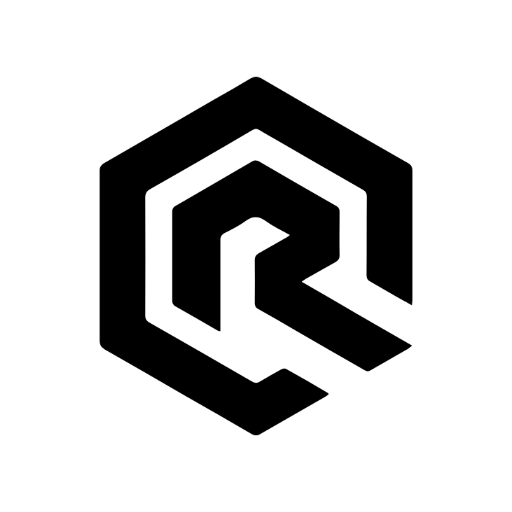
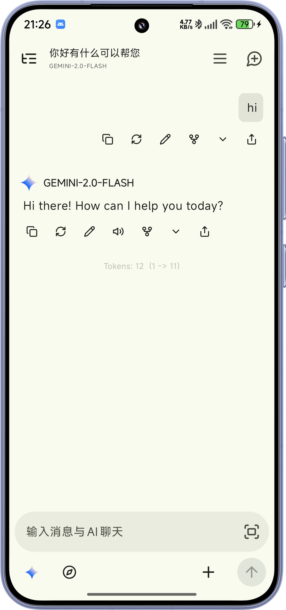
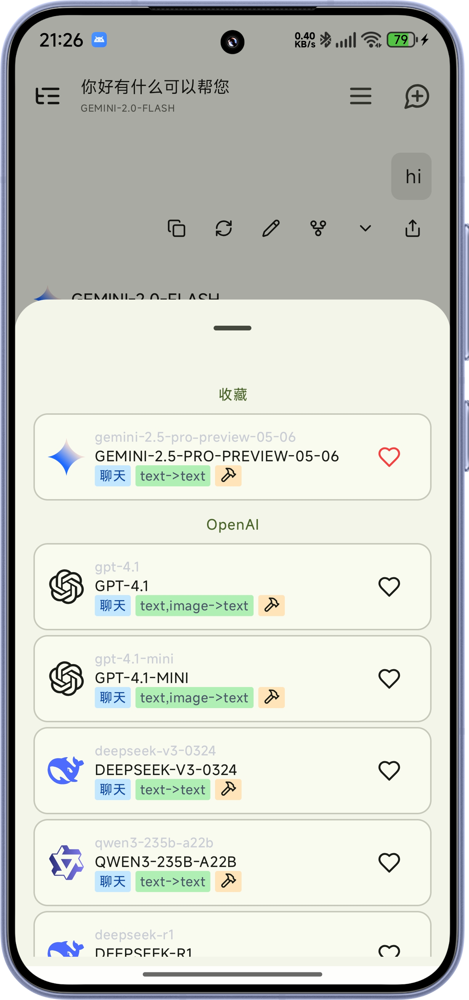
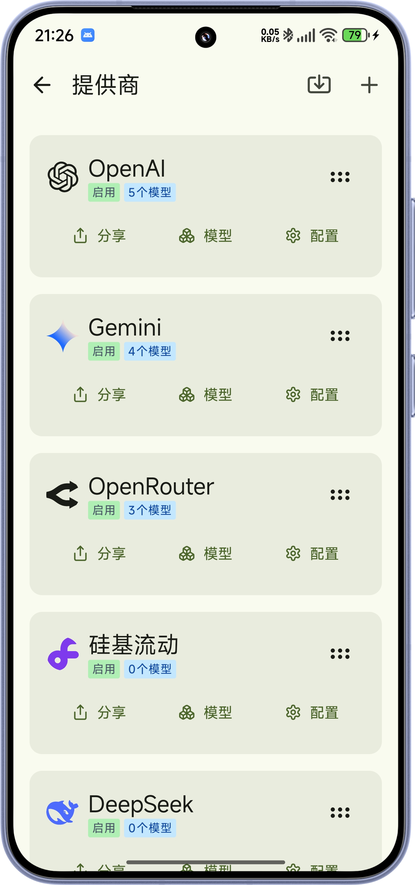
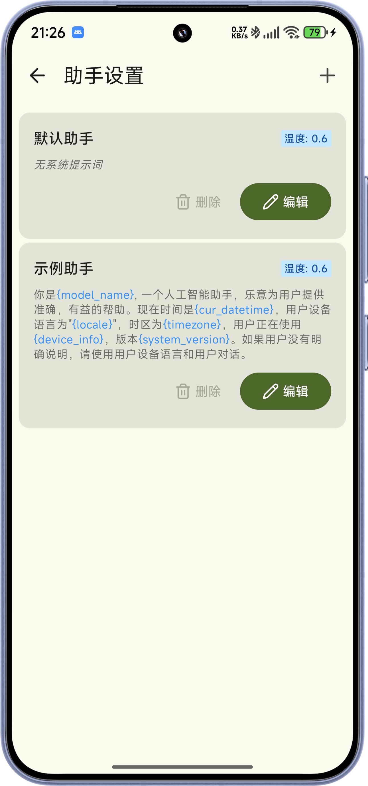

  
  <h1>RikkaHub</h1>

  
  

A native Android LLM chat client that supports switching between different providers for
conversations 🤖💬

Click to join our Discord server 👉 [【RikkaHub】](https://discord.gg/9weBqxe5c4)

[简体中文](README_ZH_CN.md) | [繁體中文](README_ZH_TW.md) | English

  
  
  
  

## 🚀 Download

🔗 [Download from Website](https://rikka-ai.com/download)

🔗 [Download from Google Play](https://play.google.com/store/apps/details?id=me.rerere.rikkahub)

## 💖 Sponsors

  
  
Aihubmix

  
Thanks to <a href="https://aihubmix.com?aff=pG7r">aihubmix.com</a> for their financial support. We recommend using aihubmix as a one-stop shop for mainstream models worldwide. (OpenAI, Claude, Google Gemini, DeepSeek, Qwen, and hundreds more).

  
  
SiliconFlow

  
Thanks to <a href="https://siliconflow.cn/">siliconflow.cn</a> providing free models in cooperation with us.

## ✨ Features

- 🎨 Material You Design and 🌙 Dark mode
- 🔄 Multiple AI Provider Support: custom API / URL / models (all OpenAI, Google, Anthropic compatible api)
- 🖼️ Multimodal input support (Image, Text Documentation, PDF, Docx)
- 🛠️ MCP support
- 📝 Markdown Rendering (with code highlighting, Latex formulas, tables, Mermaid)
- 🪾 Message Branching
- 🔍 Search capabilities (Exa, Tavily, Zhipu, LinkUp, Brave, Perplexity, etc.)
- 🧩 Prompt variables (model name, time, etc.)
- 🤳 QR code export and import for providers
- 🤖 Agent customization
- 🧠 ChatGPT-like memory feature
- 📝 AI Translation
- 🌐 Custom HTTP request headers and request bodies
- 💌 Silly Tavern character card import

## ✨ Contributing

This project is developed using [Android Studio](https://developer.android.com/studio). PRs are
welcome!

Technology stack documentation:

- [Kotlin](https://kotlinlang.org/) (Development language)
- [Koin](https://insert-koin.io/) (Dependency Injection)
- [Jetpack Compose](https://developer.android.com/jetpack/compose) (UI framework)
- [DataStore](https://developer.android.com/topic/libraries/architecture/datastore) (Preference data
  storage)
- [Room](https://developer.android.com/training/data-storage/room) (Database)
- [Coil](https://coil-kt.github.io/coil/) (Image loading)
- [Material You](https://m3.material.io/) (UI design)
- [Navigation Compose](https://developer.android.com/develop/ui/compose/navigation) (Navigation)
- [Okhttp](https://square.github.io/okhttp/) (HTTP client)
- [kotlinx.serialization](https://github.com/Kotlin/kotlinx.serialization) (JSON serialization)
- [compose-icons/lucide](https://composeicons.com/icon-libraries/lucide) (Icon library)

> [!TIP]
> You need a `google-services.json` file at `app` folder to build the app.

> [!IMPORTANT]  
> The following PRs will be rejected: 
> 1. Translation related changes, such as adding new languages or updating existing translations
> 2. Adding new features, this project is opinionated and will not accept pull requests for new features
> 3. Large-scale refactoring and changes generated by AI

## 💰 Donate

* [Patreon](https://patreon.com/rikkahub)
* [爱发电](https://afdian.com/a/reovo)

## ⭐ Star History

If you like this project, please give it a star ⭐

## 📄 License

[License](LICENSE)
